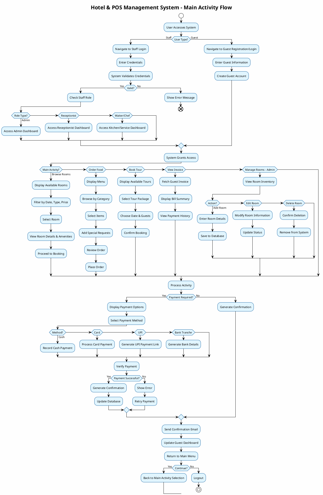
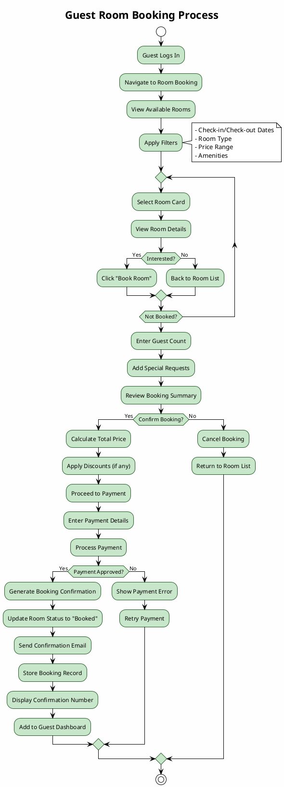
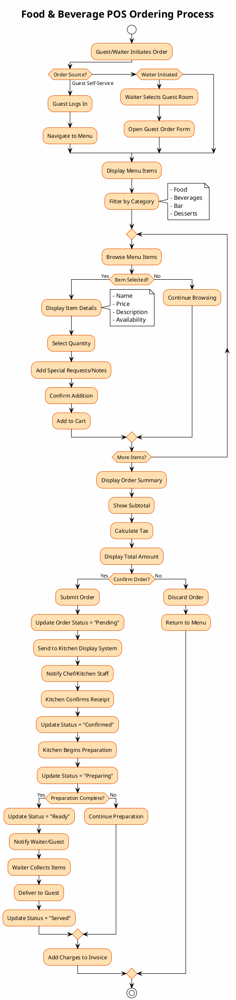
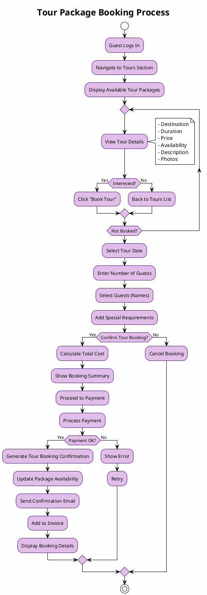
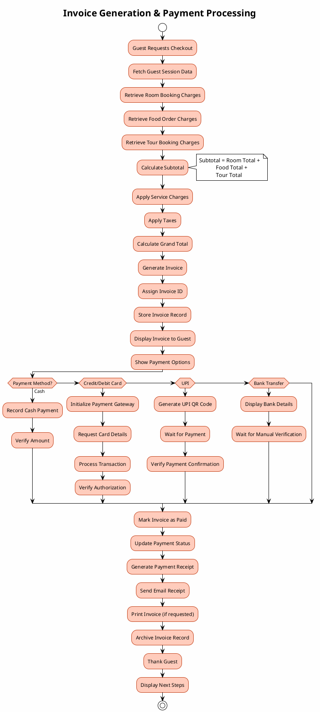
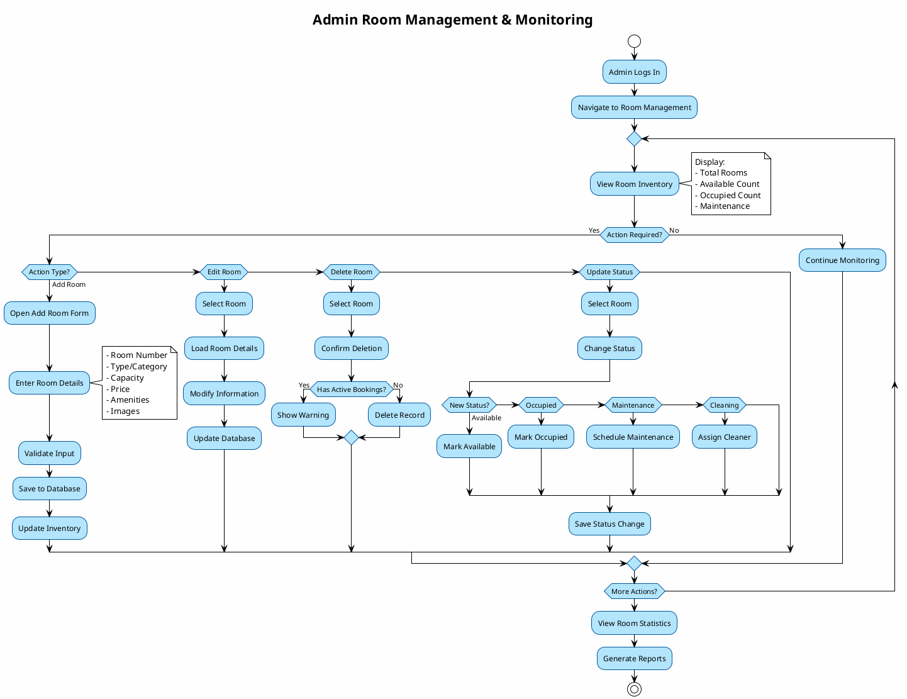
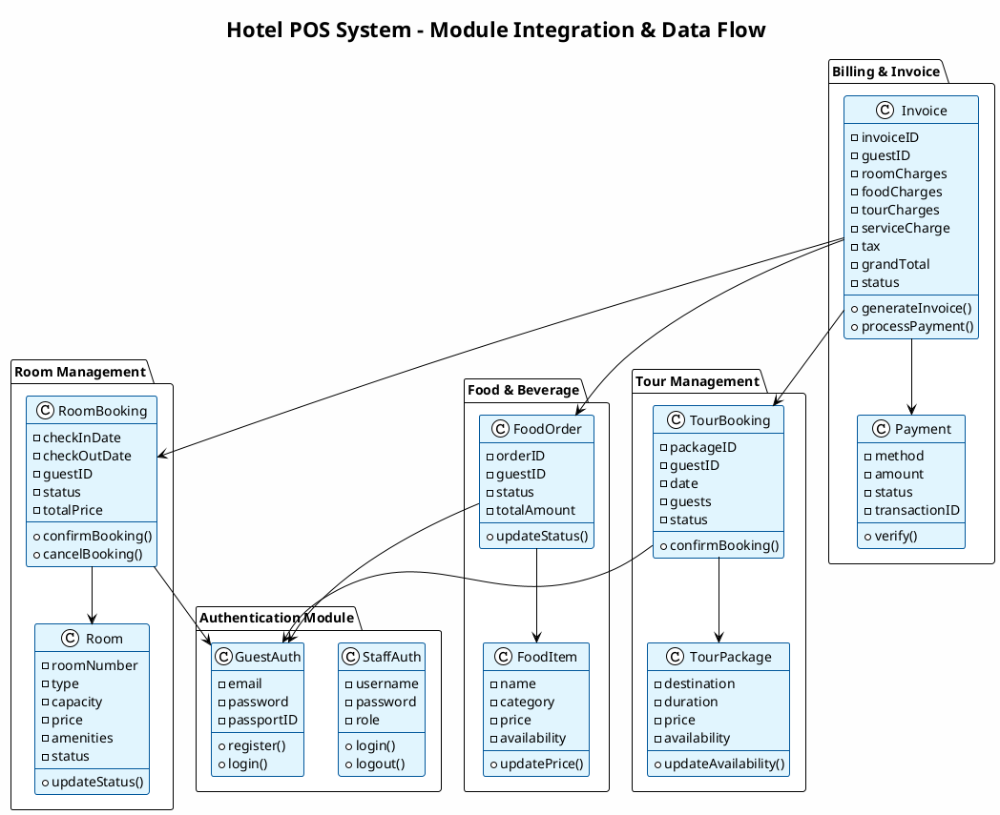
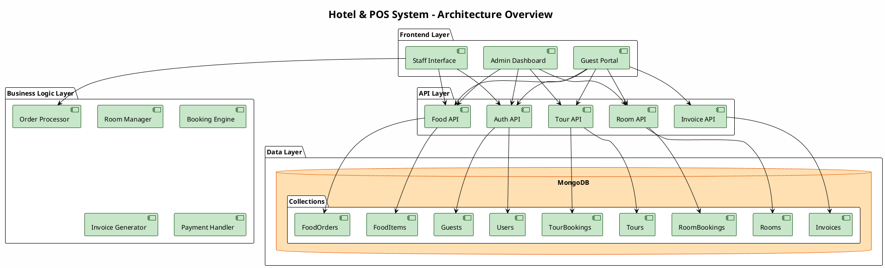
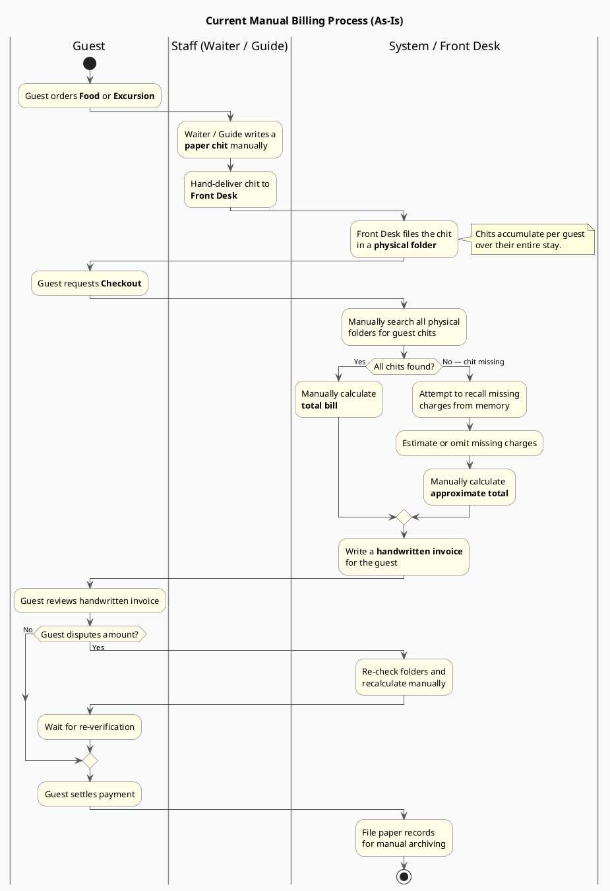
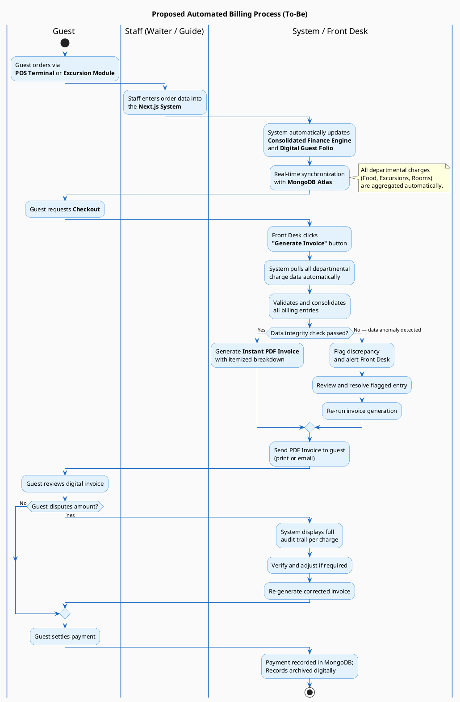

# Hotel & POS Management System - Activity Diagram

## System Overview
This document provides a comprehensive activity diagram for the **Vitamin See Hotel & POS System**, a full-stack hotel management and point-of-sale (POS) application built with Next.js and MongoDB. The system manages room bookings, food & beverage ordering, tour packages, guest management, and billing.

---

## Main System Activity Diagram

---

## Guest Room Booking Activity Flow

---

## Food & Beverage Ordering Activity Flow

---

## Tour Booking Activity Flow

---

## Invoice Generation & Payment Activity Flow

---

## Admin Room Management Activity Flow

---

## Data Model & Module Integration

---

## System Architecture - Components Flow

---

## Key Features & Process Summary

### 🏨 Room Management
- View/Add/Edit/Delete rooms
- Monitor room status (Available, Occupied, Cleaning, Maintenance)
- Set pricing and amenities
- Track bookings and occupancy

### 🍽️ Food & Beverage POS
- Menu management by category
- Real-time order processing
- Kitchen display system integration
- Order status tracking
- Special requests handling

### ✈️ Tour Booking
- Manage tour packages
- Handle tour reservations
- Track availability
- Special requirements management

### 👥 Guest Management
- Guest registration and authentication
- Profile management
- Booking history
- Payment tracking

### 💳 Billing & Invoice
- Automated invoice generation
- Multi-source charge aggregation
- Service charge and tax calculation
- Multiple payment methods
- Receipt generation and email delivery

### 🔐 Access Control
- Role-based authentication (Admin, Receptionist, Waiter, Chef)
- Guest self-service portal
- Secure session management

---

## Technology Stack

| Layer | Technology |
|-------|-----------|
| **Frontend** | Next.js 16, React, TypeScript, Tailwind CSS |
| **Backend** | Next.js API Routes, Node.js |
| **Database** | MongoDB |
| **Authentication** | JWT/NextAuth.js |
| **UI Components** | Shadcn/ui, Custom Components |
| **State Management** | React Context API |
| **Styling** | Tailwind CSS |

---

## Notes for University Report

This diagram suite demonstrates:

✅ **Complete system coverage** - All major workflows and activities  
✅ **Clear data flow** - From user input to database storage  
✅ **Role-based processes** - Different paths for guests, staff, and admins  
✅ **Error handling** - Decision points for validation and retry logic  
✅ **Integration points** - How modules communicate and share data  
✅ **Professional documentation** - Suitable for academic presentations  

---

## Billing Process Activity Diagrams — As-Is vs To-Be

> The following two swimlane diagrams model the billing workflow from the **current manual (As-Is)** state to the **proposed automated (To-Be)** state delivered by the Next.js system. Swimlanes are divided by department: **Guest**, **Staff (Waiter / Guide)**, and **System / Front Desk**.

---

### Diagram A: Current Manual Billing Process (As-Is)

---

### Diagram B: Proposed Automated Billing Process (To-Be)

---

### As-Is vs To-Be Comparison

| Aspect | As-Is (Manual) | To-Be (Automated) |
|---|---|---|
| **Order Entry** | Paper chit written by hand | Digital entry via POS / Excursion Module |
| **Charge Tracking** | Physical folders per guest | Consolidated Finance Engine + Digital Folio |
| **Data Synchronization** | None — manual handover | Real-time sync with MongoDB Atlas |
| **Invoice Generation** | Handwritten, error-prone | Instant PDF, itemized, audit-trailed |
| **Dispute Resolution** | Re-check paper files manually | Full digital audit trail on-screen |
| **Archiving** | Paper records, manual filing | Automated digital storage in MongoDB |
| **Risk of Error** | High (lost chits, miscalculation) | Low (system-validated, integrity checked) |

---

**Document Version:** 1.1  
**Generated:** 2026-05-14  
**System:** Hotel & POS Management System
