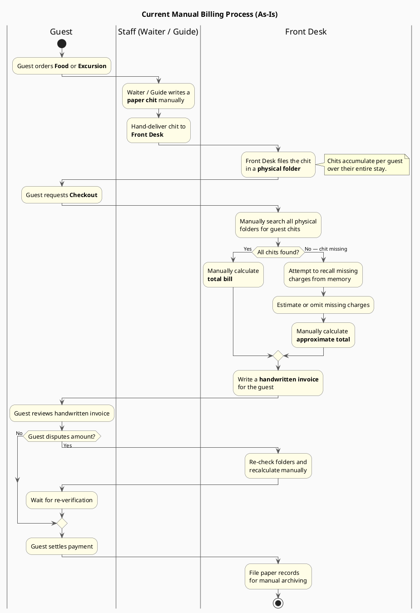
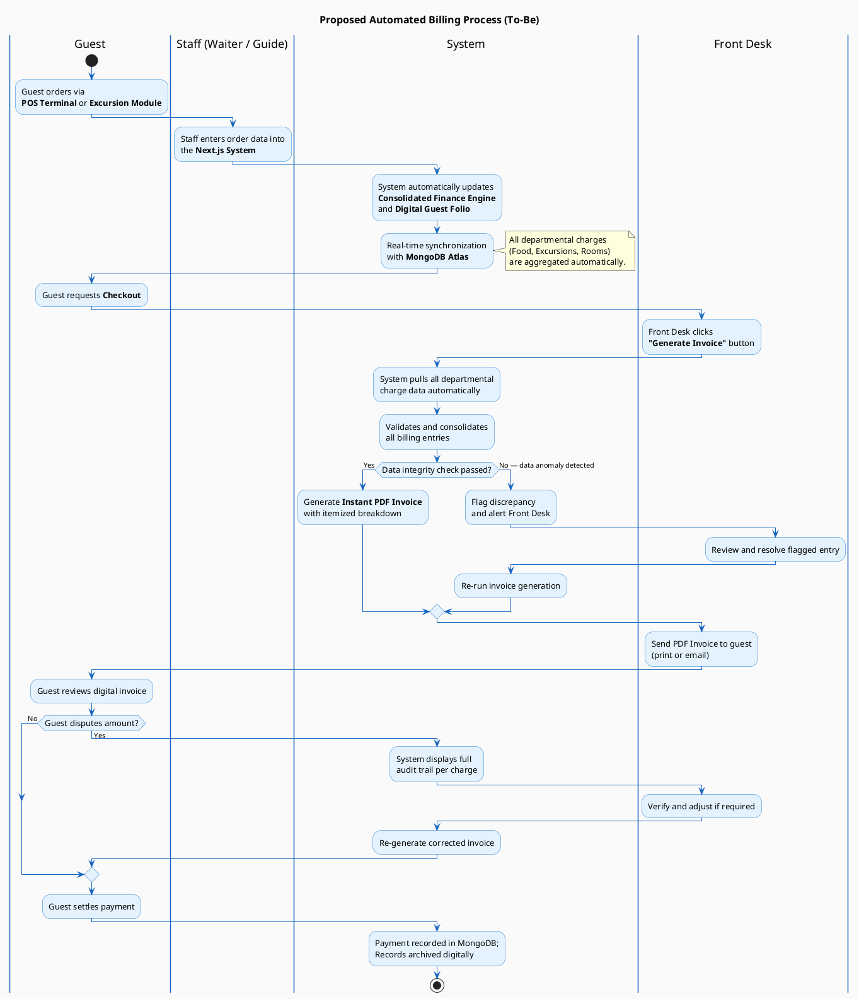

# Activity Diagrams – Hotel Management System Billing Process

## Overview

This document contains two PlantUML Activity Diagrams that model the billing workflow for the Hotel and Tour Management System:

1. **Diagram 1 – As-Is (Current Manual Process):** Documents the existing paper-based billing workflow with its inherent inefficiencies.
2. **Diagram 2 – To-Be (Proposed Automated Process):** Documents the streamlined digital billing workflow enabled by the Next.js system.

> **Usage:** Paste each `@startuml ... @enduml` block into the [PlantUML Online Server](https://www.plantuml.com/plantuml/uml/) or use the **PlantUML VS Code extension** to render the diagrams locally.

---

## Diagram 1: Current Manual Billing Process (As-Is)

---

## Diagram 2: Proposed Automated Billing Process (To-Be)

---

## Comparison Summary

| Aspect | As-Is (Manual) | To-Be (Automated) |
|---|---|---|
| **Order Entry** | Paper chit written by hand | Digital entry via POS / Excursion Module |
| **Charge Tracking** | Physical folders per guest | Consolidated Finance Engine + Digital Folio |
| **Data Synchronization** | None — manual handover | Real-time sync with MongoDB Atlas |
| **Invoice Generation** | Handwritten, error-prone | Instant PDF, itemized, audit-trailed |
| **Dispute Resolution** | Re-check paper files manually | Full digital audit trail on-screen |
| **Archiving** | Paper records, manual filing | Automated digital storage in MongoDB |
| **Risk of Error** | High (lost chits, miscalculation) | Low (system-validated, integrity checked) |
